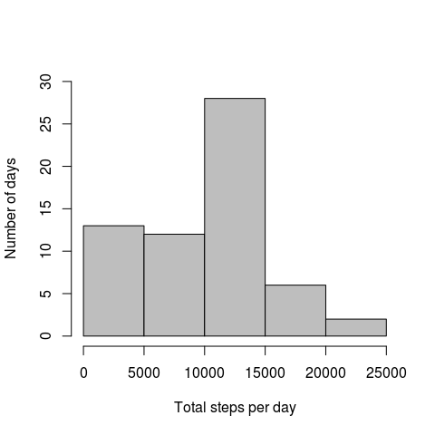
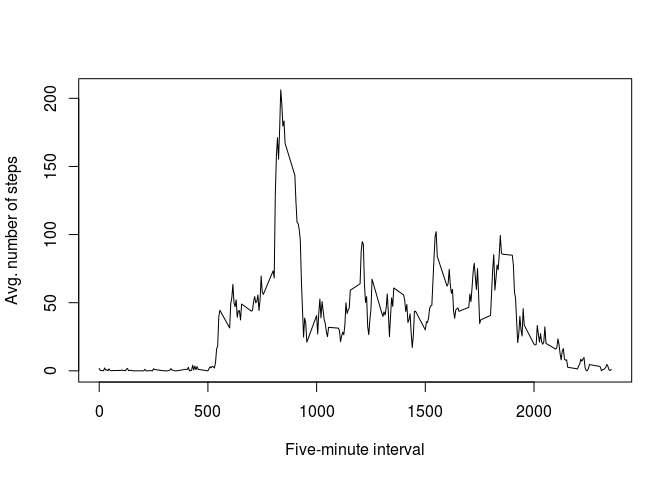
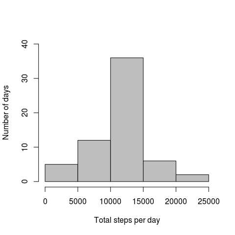
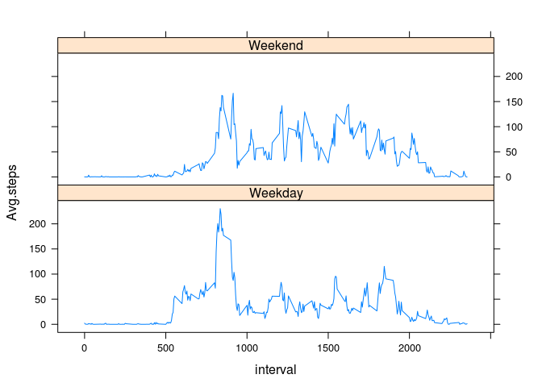

# Reproducible Research: Peer Assessment 1


Load relevant packages:

```r
library(plyr)
library(knitr)
library(lattice)
```

## Loading and preprocessing the data

Unzip the file and then read the resulting .csv file,  
storing it as the R object 'data':


```r
file <- unzip('activity.zip')
data <- read.csv(file)
```

Convert the 'date' variable (which is stored as a factor) to a date format:

```r
data$date<- as.Date(as.character(data$date))
```

## What is mean total number of steps taken per day?

Use ddply() to create a new table, spd ("steps per day"), that has only  
one row per day and the total number of steps for each day.  
Then make a histogram from the resulting steps.per.day column:

```r
spd<-ddply(data, "date",summarize, steps.per.day=sum(steps, na.rm=TRUE))
kable(head(spd),format='html')
```

<table>
 <thead>
  <tr>
   <th style="text-align:left;"> date </th>
   <th style="text-align:right;"> steps.per.day </th>
  </tr>
 </thead>
<tbody>
  <tr>
   <td style="text-align:left;"> 2012-10-01 </td>
   <td style="text-align:right;"> 0 </td>
  </tr>
  <tr>
   <td style="text-align:left;"> 2012-10-02 </td>
   <td style="text-align:right;"> 126 </td>
  </tr>
  <tr>
   <td style="text-align:left;"> 2012-10-03 </td>
   <td style="text-align:right;"> 11352 </td>
  </tr>
  <tr>
   <td style="text-align:left;"> 2012-10-04 </td>
   <td style="text-align:right;"> 12116 </td>
  </tr>
  <tr>
   <td style="text-align:left;"> 2012-10-05 </td>
   <td style="text-align:right;"> 13294 </td>
  </tr>
  <tr>
   <td style="text-align:left;"> 2012-10-06 </td>
   <td style="text-align:right;"> 15420 </td>
  </tr>
</tbody>
</table>

```r
hist(spd$steps.per.day, 
     ylim=c(0,30),
     ylab="Number of days", 
     xlab="Total steps per day",
     main='', 
     col='gray')
```




```r
Mean<- mean(spd$steps.per.day)
Median<- median(spd$steps.per.day)
```
Then mean of steps.per.day is **9354.2295082** and the median is **10395**.

## What is the average daily activity pattern?

Again use ddply() to make another new table, fiveMin, with a row for  
each distinct five-minute bin and the number of steps occuring in each  
bin averaged over all the days.  
Then this averaged data is plotted with the base plotting function:

```r
fiveMin <- ddply(data,'interval', summarize, Avg.steps = mean(steps,na.rm=TRUE))
plot(fiveMin$interval,fiveMin$Avg.steps, 
      type='l',
      xlab='Five-minute interval', 
      ylab= 'Avg. number of steps')
```



## Imputing missing values

The following command: 

```r
numNA <- sum(is.na(data))
```
shows us that there are **2304** rows with missing (NA) data.  

In order to impute these missing values we will again use ddply().  The difference between this command and the previous ddply() call is changing 'summarize' to 'transform' which appends the average for each 5-minute interval as a new column.  Then a for-loop iterates through the list and replaces the NAs with the average value for that interval.

```r
imputedData <- ddply(data,'interval', transform, Avg.steps = mean(steps,na.rm=TRUE))
for( i in 1:nrow(imputedData)){
  if (is.na(imputedData[i,1])==TRUE){
    imputedData[i,1]<- imputedData[i,4]
    }
}
imputedData$steps<-round(imputedData$steps,digits=2)
imputedData<-imputedData[,1:3]
```

Now we present a the same commands that produced the histogram for total number of steps, this time with the imputed data:

```r
ispd<-ddply(imputedData, "date",summarize, steps.per.day=sum(steps, na.rm=TRUE))
kable(head(ispd),format='html')
```

<table>
 <thead>
  <tr>
   <th style="text-align:left;"> date </th>
   <th style="text-align:right;"> steps.per.day </th>
  </tr>
 </thead>
<tbody>
  <tr>
   <td style="text-align:left;"> 2012-10-01 </td>
   <td style="text-align:right;"> 10766.13 </td>
  </tr>
  <tr>
   <td style="text-align:left;"> 2012-10-02 </td>
   <td style="text-align:right;"> 126.00 </td>
  </tr>
  <tr>
   <td style="text-align:left;"> 2012-10-03 </td>
   <td style="text-align:right;"> 11352.00 </td>
  </tr>
  <tr>
   <td style="text-align:left;"> 2012-10-04 </td>
   <td style="text-align:right;"> 12116.00 </td>
  </tr>
  <tr>
   <td style="text-align:left;"> 2012-10-05 </td>
   <td style="text-align:right;"> 13294.00 </td>
  </tr>
  <tr>
   <td style="text-align:left;"> 2012-10-06 </td>
   <td style="text-align:right;"> 15420.00 </td>
  </tr>
</tbody>
</table>

```r
hist(ispd$steps.per.day, 
     ylim=c(0,40),
     ylab="Number of days", 
     xlab="Total steps per day",
     main='', 
     col='gray')
```



```r
mean(ispd$steps.per.day)
```

```
## [1] 10766.18
```

```r
median(ispd$steps.per.day)
```

```
## [1] 10766.13
```

It seems that imputing the missing values makes the distribution more normalized, raising the mean to equal the median.

## Are there differences in activity patterns between weekdays and weekends?

First weekdays() is used to add a new column with the day name, then a for loop replaces 'Saturday' and 'Sunday' with 'Weekend' and all other values with 'Weekday'.

```r
imputedData$wkday <- weekdays(imputedData$date)
for( i in 1:nrow(imputedData)){
  if (imputedData[i,4]=='Saturday' | imputedData[i,4]=='Sunday' ){
    imputedData[i,4]<- 'Weekend'
  }
  else{
    imputedData[i,4]<-'Weekday'
  }
}
imputedData$wkday<-as.factor(imputedData$wkday)

fiveMin2 <- ddply(imputedData,c('interval','wkday'), summarize, Avg.steps = mean(steps))
```

Then we plot using the lattice plotting system.

```r
xyplot(Avg.steps~interval|wkday,fiveMin2,layout=c(1,2),type='l')
```


